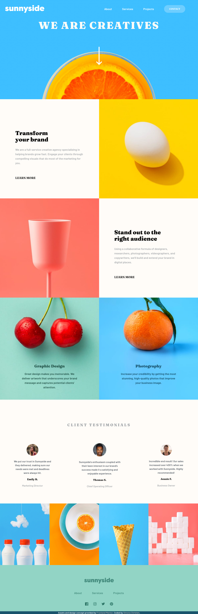
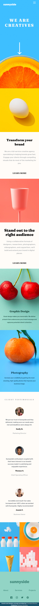

# Sunnyside Landing Page

## Table of contents

- [Overview](#overview)
  - [Functionality](#functionality)
  - [Screenshot](#screenshot)
- [My process](#my-process)
  - [Built with](#built-with)
  - [What I learned](#what-i-learned)
  - [Continued development](#continued-development)
  - [Useful resources](#useful-resources)
- [Author](#author)
- [Acknowledgments](#acknowledgments)

## Overview

This web application serves to act as a responsive landing page for the fictitious company Sunnyside. This was a challenge from [Frontend Mentor](https://www.frontendmentor.io), which provided a PDF design file along with all the necessary assets to build the page.

### Functionality

Users should be able to:

- View the optimal layout for the site depending on their device's screen size
- Toggle the mobile menu for smaller screen sizes

### Screenshots

Taken on September 13, 2021.

Desktop


Mobile



## My process

### Built with

- Semantic HTML5 markup
- SCSS
- Flexbox
- CSS Grid
- Basic Javascript for the menu toggle
- Bootstrapped with Prettier

### What I learned

Since I did not have access to the Figma files and only had PDFs to work with for the design concepts (mobile and desktop), I elected with sketching out the layouts in my notebook. I was surprised to find that I did a majority of the problem-solving at this stage rather than when I opened up my code editor to begin.

The testimonials section, for instance, at first worried me because I knew I wanted to have a general grid system for the desktop design and then a flexbox within a grid item for the testimonial content. My main concern stemmed from the conversion of the desktop design to the mobile one and how a single column format was going to impact the previously three horizontal item flexbox. After actually sketching out the design, it became clear that I could easily solve this by just changing the `flex-direction` to `column`.

Additionally, I retroactivley added Sass to this project when it was near completion to help reinforce Sass concepts I learned recently. While going forward I will likely use Sass from the start, I found it to be a good learning experience to return to an older codebase and convert it. By nesting my CSS and using `mixins`, I was able to reduce the total lines of code I was producing.

```
@mixin colorTextBlock {
  text-align: center;
  margin-top: 26rem;
  margin-left: 8rem;
  margin-right: 8rem;
  margin-bottom: 4rem;
  line-height: 1.75rem;
}

.cherry-text {
  @include colorTextBlock;
}

...

.peach-text {
  @include colorTextBlock;
}
```

### Continued development

The original design concept for this challenge was for a screen-width of 1440px. In addition to tweaking some of the media queries to keep content as readable as possible at smaller screen sizes, I may look to also improve the user experience for those screen sizes exceeding 1440px.

### Useful resources

[Sass Documentation](https://sass-lang.com/documentation)

## Author

- Portfolio - [Simone Christen](https://sunnfast.github.io/)
- [Github](https://www.github.com/Sunnfast)
- [LinkedIn](https://www.linkedin.com/in/simonechristen/)

## Acknowledgments

Thanks to [Frontend Mentor](https://www.frontendmentor.io) for providing the prompt and the necessary assets.
